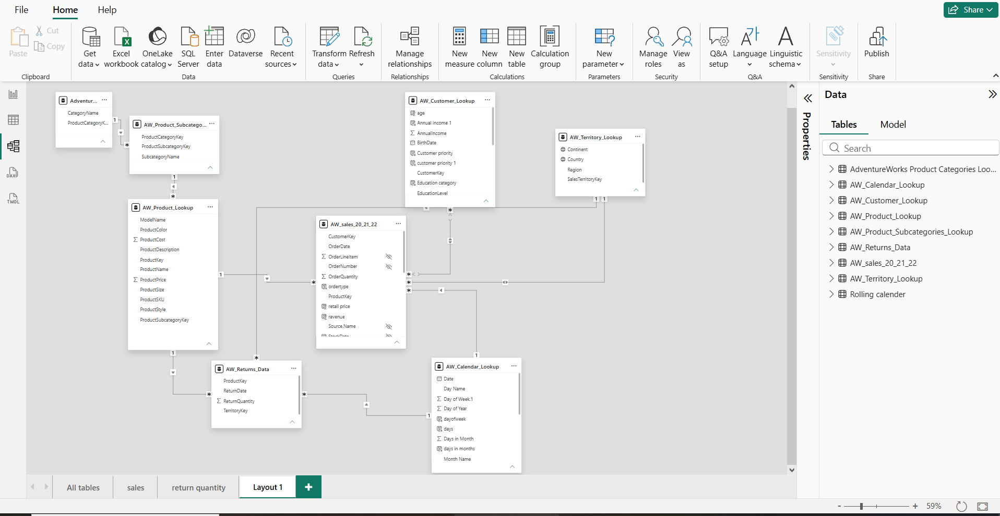

# Enterprise Data Modelling & Advanced ETL (Power BI)

An advanced Power BI architecture project focused heavily on backend ETL processes using Power Query, data optimization, and implementing an efficient Star Schema Data Model.

## 📐 Data Architecture & Relationships

*(Note to Recruiters: This screenshot showcases the structured Star Schema relationship layout built to optimize DAX query performance and reduce data redundancy).*

## 🎯 Project Focus & Technical Strengths
Unlike front-end visual heavy dashboards, the primary objective of this project was to establish a solid data warehouse foundation. It addresses high-volume data challenges through structured schema definitions.

## 🛠️ Power Query (ETL) Transformations Implemented:
* **Data Cleaning:** Handled missing/null values, removed duplicates, and performed structural columns splitting.
* **Data Type Enforcement:** Rectified date-time stamps and enforced strict data types across all raw tables.
* **Custom Columns:** Generated conditional attributes and index keys to facilitate smooth relational bindings.

## 🔗 Data Modelling & Schema Optimization:
* **Star Schema Architecture:** Separated analytical data into highly structured **Fact Tables** and **Dimension Tables**.
* **Relationship Engineering:** Established optimal **1-to-Many ($1 \rightarrow *)$** relationships and configured precise cross-filter directions.
* **Time Intelligence Support:** integrated a dedicated Calendar Lookup dimension table to support robust temporal and seasonal DAX calculations.
